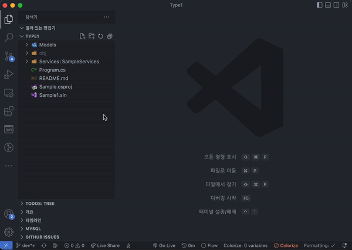

# New CS File

<!--

-->

  

## 기능

네임스페이스가 포함된 새 .cs 파일을 작성합니다.

- 네임스페이스는 프로젝트 파일의 이름 또는 프로젝트 파일의 기본 네임스페이스 `DefaultNamespace` 요소를 참조합니다.

<!--

> Tip: Many popular extensions utilize animations. This is an excellent way to show off your extension! We recommend short, focused animations that are easy to follow.
-->

### 네임스페이스

네임스페이스는 프로젝트 파일의 이름과 파일을 작성하는 디렉터리 구조를 기반으로 합성합니다.

네임스페이스의 베이스는 프로젝트 파일 이름 또는 프로젝트 파일의 기본 네임스페이스 `DefaultNamespace` 요소의 내용을 사용합니다.

## 제한사항

프로젝트의 디렉터리와 파일이름은 알파벳 문자와 숫자만 사용될 수 있습니다.

## Release Notes

### 0.2.1

- 윈도우즈에서 작동하지 않는 문제를 수정 #56

### 0.1.5

- 파일 덮어쓰기를 금지합니다. #24

### 0.1.4

- README.md 업데이트; 예제 애니메이션 파일을 추가했어요. 🫣

### 0.1.3

- 확장의 동작을 확인합니다.
- CI/CD 워크플로우를 확인합니다.

---
